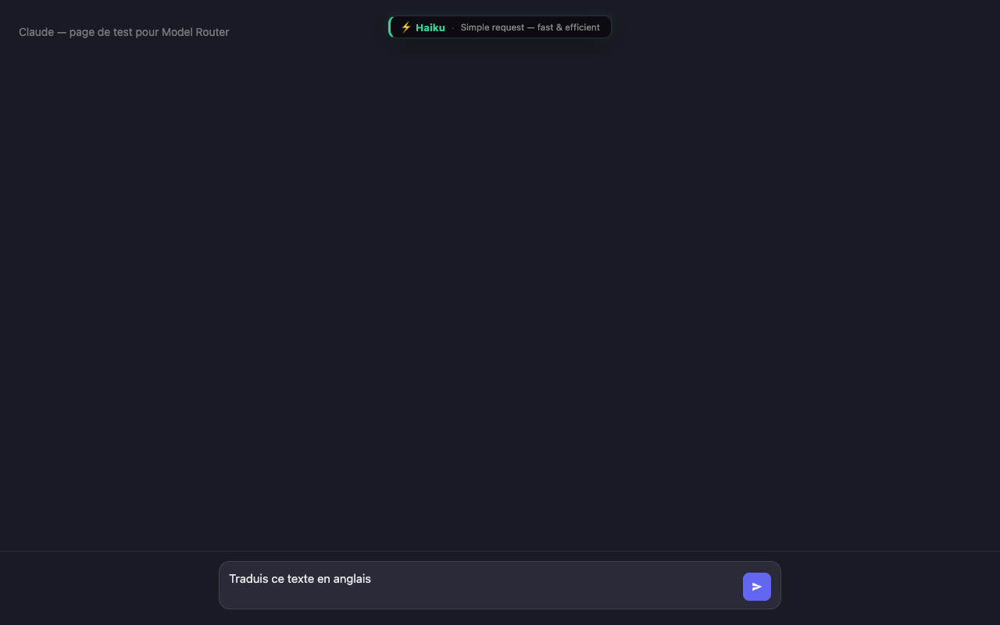
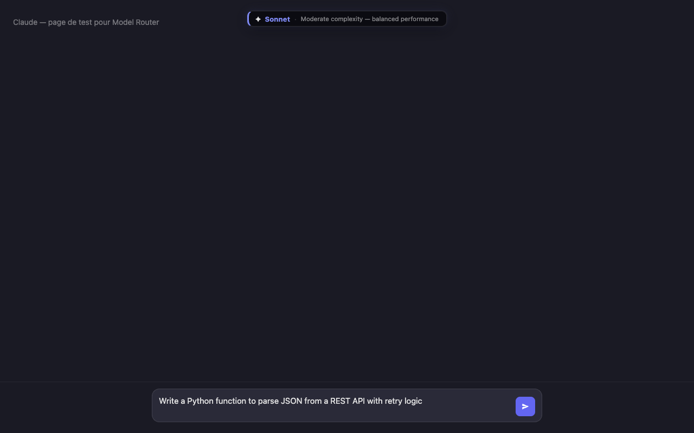
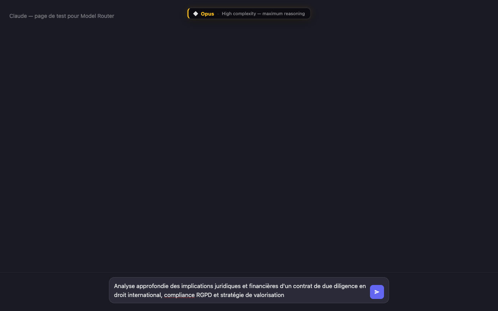
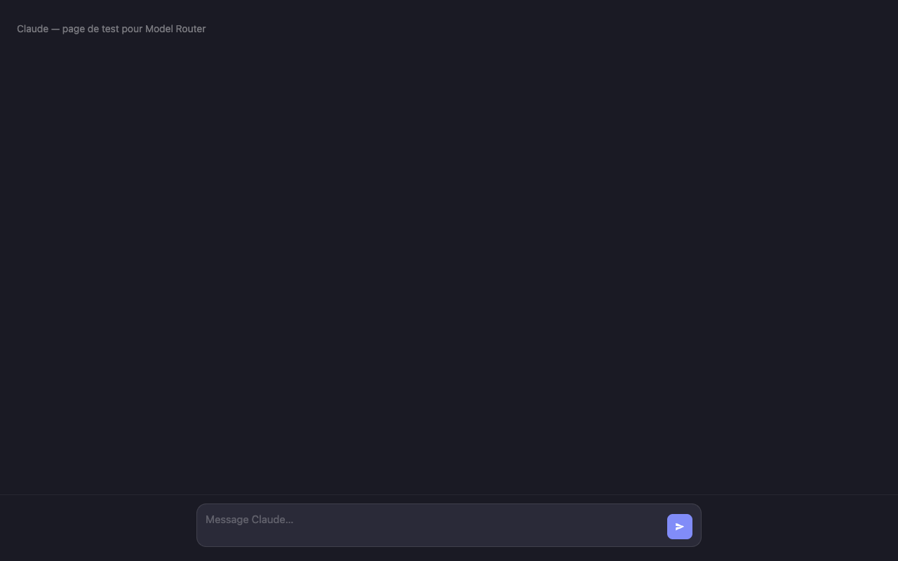

# Model Router for Claude

Chrome extension that analyses your query complexity in real time and suggests the optimal Claude model — **100% local, no external calls, works in French and English**.

---

## Overview

As you type in claude.ai, a badge appears at the top of the page and updates on every keystroke:

| Badge | Model | Use case |
|---|---|---|
| ⚡ **Haiku** | Fast & lightweight | Translations, summaries, definitions, corrections, rephrasing |
| ✦ **Sonnet** | Balanced | Code (Python, React, SQL…), writing, standard technical tasks |
| ◆ **Opus** | Maximum reasoning | In-depth research, law, finance, strategy, multi-step tasks |

### ⚡ Haiku — simple request (FR)



### ✦ Sonnet — code & technical (EN)



### ◆ Opus — complex analysis (FR)



### After send — badge cleared



---

## Installation

1. Clone or download this repository
2. Open `chrome://extensions`
3. Enable **Developer mode** (top right)
4. Click **Load unpacked**
5. Select the `model-router-extension/` folder
6. Go to [claude.ai](https://claude.ai) and start typing

---

## Bilingual support (FR + EN)

The algorithm analyses keywords in **both languages simultaneously**, regardless of which language you use. No configuration needed.

### Haiku keywords

| French | English |
|---|---|
| `traduis` | `translate` |
| `résume` | `summarize`, `sum up` |
| `définis` | `define` |
| `liste` | `list`, `enumerate` |
| `corrige` | `fix`, `correct`, `proofread` |
| `reformule` | `rephrase`, `reword`, `paraphrase` |
| `explique` | `explain`, `clarify` |
| `décris` | `describe` |

### Opus domain keywords (sample)

| Domain | French | English |
|---|---|---|
| Academic | `recherche`, `méthodologie` | `research`, `academic`, `scholarly` |
| Legal | `juridique`, `contrat`, `litige` | `legal`, `contract`, `litigation`, `regulatory` |
| Financial | `investissement`, `due diligence` | `financial`, `valuation`, `cash flow`, `forecasting` |
| Scientific | `régression`, `modélisation` | `regression`, `data science`, `simulation` |
| Strategy | `stratégie`, `architecture` | `strategy`, `competitive analysis`, `roadmap` |
| Analysis | `analyse approfondie` | `explain in depth`, `analyze in detail`, `thorough analysis` |

### Language detection

The `detectLanguage()` function identifies the request language (`fr` / `en` / `mixed`) by counting French diacritics and stop-words against English stop-words. This is **informational only** — scoring always runs both dictionaries in parallel.

---

## Heuristic algorithm

The score (0–100) is computed across **4 dimensions**, all locally:

### 1. Enriched dictionaries

- **Haiku** — simple imperative verbs at the start of a sentence, in FR or EN
- **Sonnet** — 35+ programming languages and frameworks: `python`, `javascript`, `react`, `sql`, `docker`, `typescript`, `graphql`… → guaranteed Sonnet floor
- **Opus** — 60+ terms across academic, legal, financial, and scientific domains → Opus floor when 2+ hits

### 2. Sentence structure

- **Sentence count**: 1 → Haiku signal · 2-3 → Sonnet · 4+ → Opus
- **Multi-step connectors** — FR: `ensuite`, `également`, `d'abord` · EN: `then`, `furthermore`, `additionally`, `moreover`… — 2+ connectors → forced Opus floor
- **Single-sentence imperative** → reinforced penalty

### 3. Conversation context

Silent, non-blocking DOM read (try/catch):

| Condition | Effect |
|---|---|
| 1–2 exchanges | +3 pts |
| 3–4 exchanges | +8 pts |
| 5+ exchanges | +15 pts |
| Code detected in history (`<pre>`, `<code>`) | +4–10 pts, Sonnet floor |
| Long conversation + code | Opus floor |

### 4. Content type

| Signal | Effect |
|---|---|
| URL (`https://…`) | +15 pts, Sonnet floor |
| Short code block ` ``` ` | +18 pts, Sonnet floor |
| Long code block (>300 chars) | +25 pts, Opus floor |
| 5+ numeric values | +10 pts, Sonnet floor |
| File reference (`.pdf`, `.csv`, `.xlsx`…) | +15 pts, Sonnet floor |

### Decision thresholds

```
Score  0–31  →  ⚡ Haiku
Score 32–63  →  ✦ Sonnet
Score 64–100 →  ◆ Opus
```

Strong signals (languages, connectors, URLs, files) set a **floor** (`minScore`) that guarantees a minimum model regardless of other criteria.

---

## Project structure

```
model-router-extension/
├── manifest.json   — Manifest V3, injected on claude.ai/*
├── content.js      — Heuristic algorithm + badge management
├── styles.css      — Badge styles (glassmorphism, colour-coded border)
├── popup.html      — Enable/disable popup (English UI)
└── popup.js        — Popup logic (chrome.storage)
```

---

## Privacy

- No data sent to any external server
- No API calls
- All processing happens in the browser, in memory, on each keystroke
- The only network permission is `host_permissions: ["https://claude.ai/*"]` for script injection
